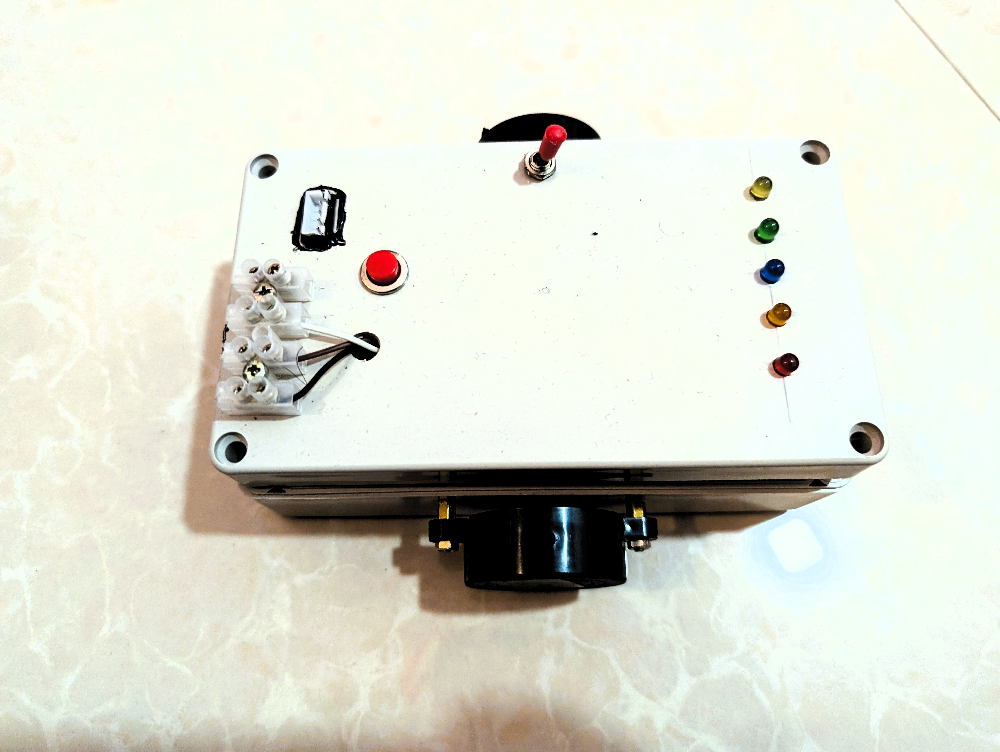
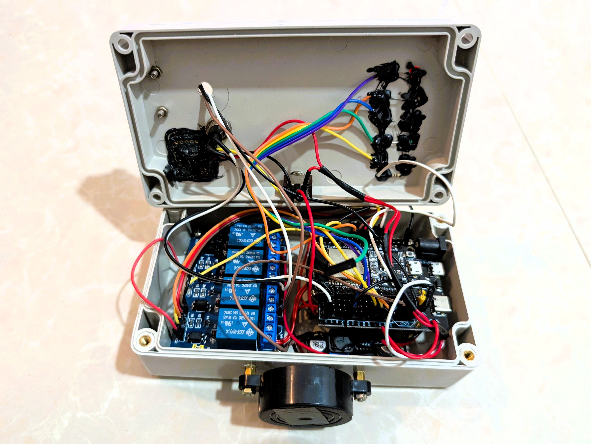
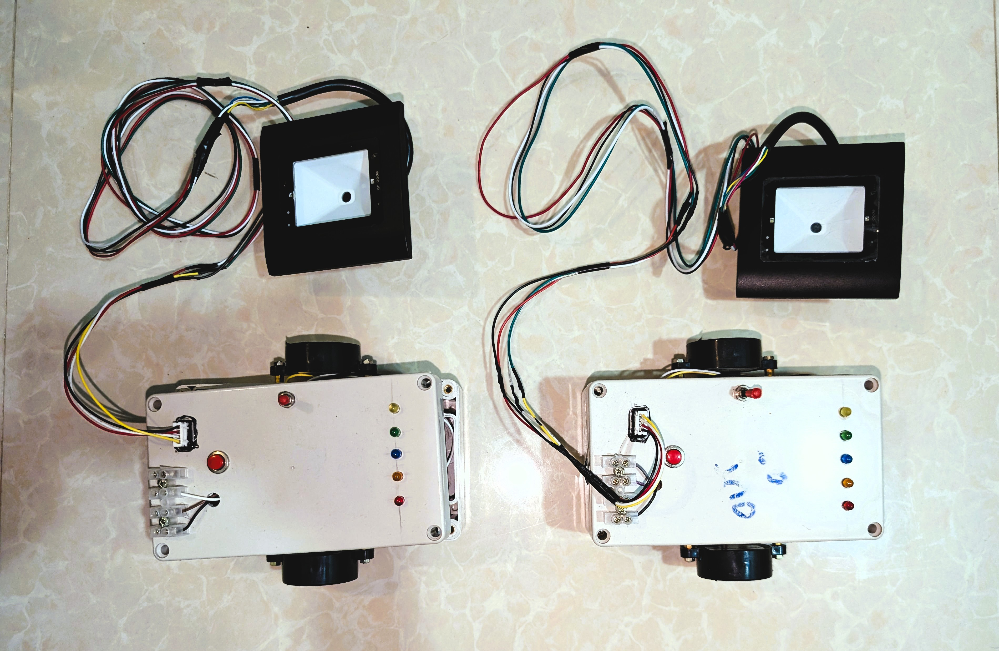
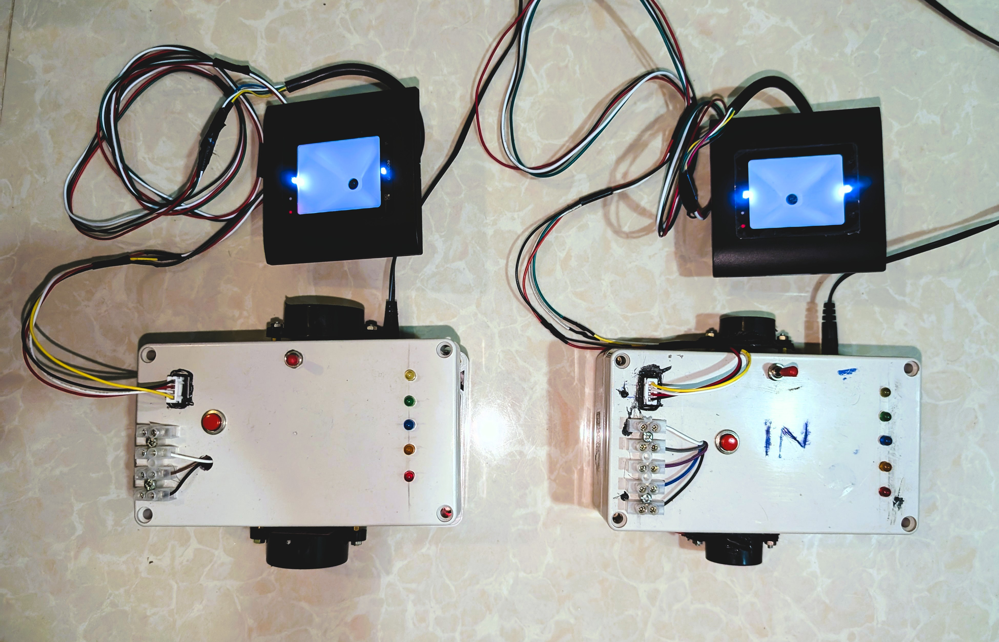
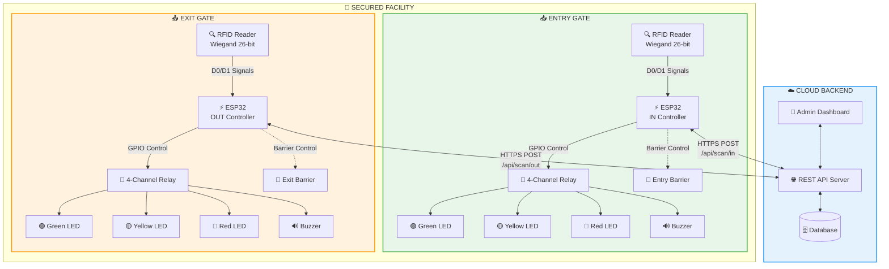
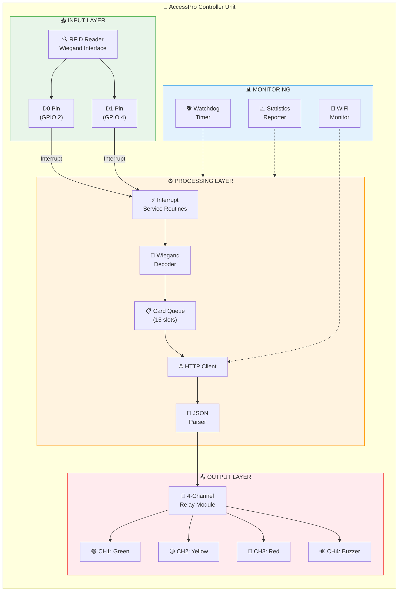
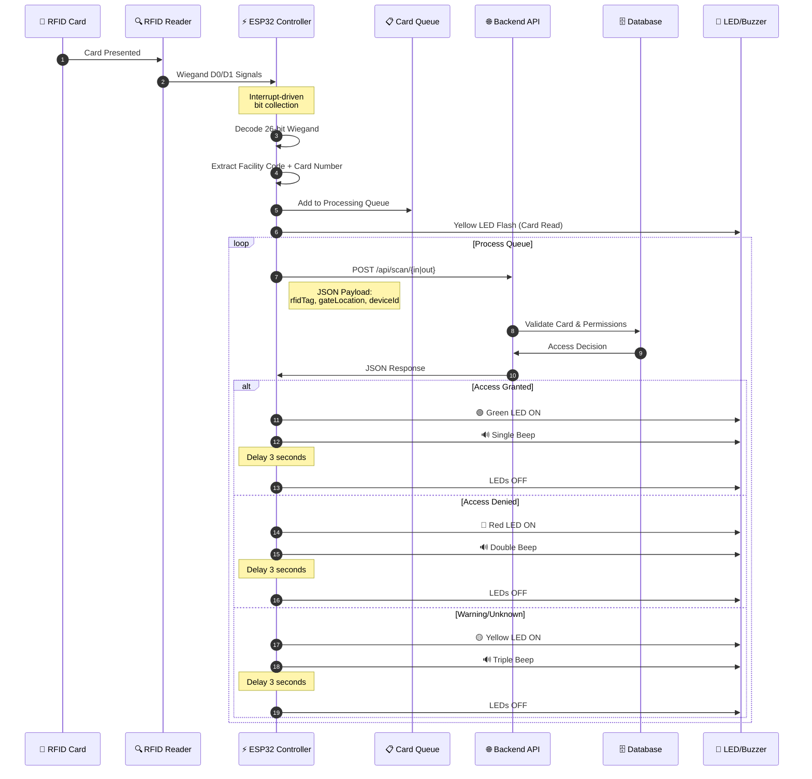
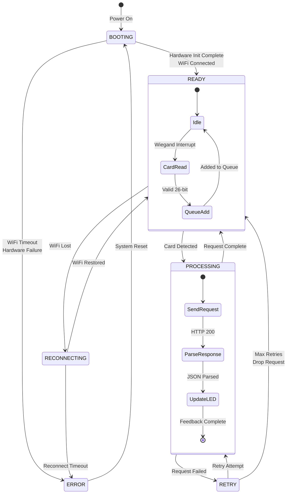
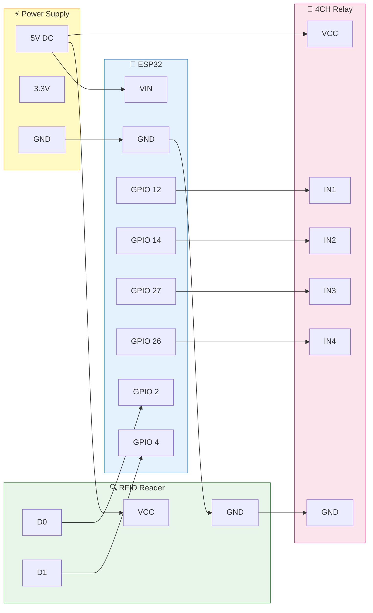

<div align="center">
  <h1>🚪 AccessPro - RFID Gate Access Control System</h1>
  
  ### 🔐 ESP32-Based Smart Access Control with Real-Time API Integration
  
  **Enterprise-Grade Access Management**  
  *Wiegand RFID • Cloud Integration • Multi-Gate Support • Real-Time Monitoring*


<br>

  
  
  
  
</div>

---

## 🎯 Project Overview

**AccessPro** is a production-grade RFID access control system designed for managing entry and exit at secured locations. Built on the ESP32 microcontroller platform, it integrates seamlessly with cloud-based backend APIs to provide real-time access validation, logging, and monitoring. The system supports high-throughput environments with a capacity of **3000+ card reads per hour**.

<div align="center">
  
  
  <br><br>
  
  
</div>

---

## ✨ Key Features & Capabilities

### 🔒 **Wiegand 26-Bit RFID Integration**
Industry-standard Wiegand protocol support for compatibility with a wide range of RFID readers and access cards. Interrupt-driven processing ensures no card reads are missed.

### ☁️ **Cloud API Integration**
Real-time HTTP/HTTPS communication with backend servers for instant access validation. Supports JSON payload with device identification and gate location tracking.

### 🚦 **Visual & Audio Feedback System**
4-channel relay module controlling:
- **Green LED**: Access Granted
- **Yellow LED**: Processing/Warning
- **Red LED**: Access Denied
- **Buzzer**: Audio confirmation patterns

### 📊 **Smart Queue Management**
Circular queue system (15 cards capacity) ensures reliable processing during high-traffic periods with automatic retry mechanism for failed requests.

### 🔄 **Self-Healing Connectivity**
Automatic WiFi reconnection with monitoring and watchdog timer protection for 24/7 unattended operation.

### 📈 **Performance Monitoring**
Built-in statistics reporting including reads per hour, success rates, uptime tracking, and memory monitoring.

---

## 🏗️ System Architecture

### Complete Gate Control System (IN & OUT)



---

### Single Unit Architecture



---

### Access Request Flow



---

### System State Machine



---

## 🛠️ Technology Stack & Components

<div align="center">

| **Category** | **Components/Technologies** |
|--------------|---------------------------|
| **Microcontroller** | ESP32 Development Board |
| **RFID Protocol** | Wiegand 26-bit Interface |
| **Communication** | WiFi 802.11 b/g/n, HTTPS |
| **Data Format** | JSON (ArduinoJson Library) |
| **Output Control** | 4-Channel Relay Module (Active LOW) |
| **Indicators** | LEDs (Green/Yellow/Red), Piezo Buzzer |
| **Reliability** | Hardware Watchdog Timer (30s) |
| **Programming** | Arduino IDE, C++ |

</div>

---

## ⚙️ Hardware Configuration

### Pin Mapping

```
ESP32 Pin Connections:
├── Wiegand RFID Reader
│   ├── D0 → GPIO 2  (Data 0 - Interrupt)
│   └── D1 → GPIO 4  (Data 1 - Interrupt)
│
├── 4-Channel Relay Module (Active LOW)
│   ├── Channel 1 (Green LED)  → GPIO 12
│   ├── Channel 2 (Yellow LED) → GPIO 14
│   ├── Channel 3 (Red LED)    → GPIO 27
│   └── Channel 4 (Buzzer)     → GPIO 26
│
└── Status Indicator
    └── Built-in LED → GPIO 2
```

### Wiring Diagram



---

## 📡 API Communication

### Request Format

```json
POST /api/scan/{in|out}
Content-Type: application/json

{
  "rfidTag": "123-45678",
  "gateLocation": "IN",
  "deviceId": "front_in_scanner_1"
}
```

### Response Format

```json
{
  "success": true,
  "result": "GREEN",
  "message": "Access granted for John Doe"
}
```

### Response Handling

| **Result** | **LED** | **Buzzer Pattern** | **Duration** |
|------------|---------|-------------------|--------------|
| `GREEN` + success | 🟢 Green | Single beep (150ms) | 3 seconds |
| `RED` or !success | 🔴 Red | Double beep (100ms x2) | 3 seconds |
| Other/Warning | 🟡 Yellow | Triple beep (80ms x3) | 3 seconds |

---

## 🔧 Code Structure & Key Functions

### Main Components

```
mainController.ino
├── Configuration Section
│   ├── WiFi credentials
│   ├── API endpoint configuration
│   └── Performance settings
│
├── Wiegand Processing
│   ├── D0_ISR() - Data bit 0 interrupt
│   ├── D1_ISR() - Data bit 1 interrupt
│   ├── checkWiegandData() - Timeout detection
│   └── processCardRead() - 26-bit decoding
│
├── Queue Management
│   ├── initializeQueue() - Initialize circular queue
│   ├── addToQueue() - Add card to queue
│   ├── processQueue() - Process pending requests
│   └── markQueueItemProcessed() - Remove from queue
│
├── API Communication
│   ├── sendAPIRequest() - HTTP POST request
│   ├── parseAndProcessResponse() - JSON parsing
│   └── handleRequestFailure() - Retry logic
│
├── Output Control
│   ├── controlLED() - LED state management
│   ├── controlBuzzer() - Audio feedback patterns
│   └── turnOffAllLEDs() - Reset all outputs
│
└── System Monitoring
    ├── maintainWiFi() - Connection maintenance
    ├── systemMonitoring() - Periodic checks
    └── reportStats() - Performance reporting
```

### Key Function Explanations

#### **Wiegand Interrupt Handlers**
```cpp
void IRAM_ATTR D0_ISR() {
  if (bitCount < 32) {
    cardData <<= 1;      // Shift left, add 0
    bitCount++;
    lastBitTime = millis();
  }
}

void IRAM_ATTR D1_ISR() {
  if (bitCount < 32) {
    cardData <<= 1;
    cardData |= 1;       // Shift left, add 1
    bitCount++;
    lastBitTime = millis();
  }
}
```
These interrupt service routines (ISRs) are marked with `IRAM_ATTR` to ensure they run from RAM for faster execution. They capture each bit of the Wiegand data stream.

#### **26-Bit Card Decoding**
```cpp
// Extract facility code (bits 2-9) and card number (bits 10-25)
unsigned long facilityCode = (cardData >> 17) & 0xFF;
unsigned long cardNumber = (cardData >> 1) & 0xFFFF;
String cardId = String(facilityCode) + "-" + String(cardNumber);
```
The Wiegand 26-bit format includes 1 parity bit, 8 facility code bits, 16 card number bits, and 1 parity bit.

#### **Queue-Based Processing**
```cpp
bool addToQueue(String cardId) {
  if (queueCount >= CARD_QUEUE_SIZE) return false;
  
  cardQueue[queueTail].cardId = cardId;
  cardQueue[queueTail].timestamp = millis();
  cardQueue[queueTail].processed = false;
  cardQueue[queueTail].retryCount = 0;
  
  queueTail = (queueTail + 1) % CARD_QUEUE_SIZE;
  queueCount++;
  return true;
}
```
Circular queue implementation ensures cards are processed in order even during high traffic periods.

---

## 📊 Performance Specifications

<div align="center">

| **Specification** | **Value** | **Notes** |
|-------------------|-----------|-----------|
| **Processing Capacity** | 3000+ reads/hour | Production-grade throughput |
| **HTTP Timeout** | 8 seconds | Per request |
| **WiFi Reconnect Time** | <10 seconds | Automatic recovery |
| **Queue Capacity** | 15 cards | Circular buffer |
| **Retry Attempts** | 3 | Before dropping request |
| **Watchdog Timeout** | 30 seconds | System auto-reset |
| **Wiegand Wait Time** | 50ms | Bit completion timeout |
| **Stats Report Interval** | 60 seconds | Performance logging |
| **Heartbeat Interval** | 30 seconds | System alive indicator |

</div>

---

## 🚀 Getting Started

### Prerequisites
- Arduino IDE 1.8.19+ or PlatformIO
- ESP32 Board Package
- Required Libraries:
  - `WiFi.h` (Built-in)
  - `HTTPClient.h` (Built-in)
  - `ArduinoJson` (Install via Library Manager)

### Installation & Setup

1. **Clone the repository**
   ```bash
   git clone https://github.com/Ravinx001/AccessPro.git
   cd AccessPro
   ```

2. **Configure WiFi & API**
   Edit these lines in `mainController.ino`:
   ```cpp
   const char* WIFI_SSID = "Your_WiFi_SSID";
   const char* WIFI_PASSWORD = "Your_WiFi_Password";
   const String API_BASE_URL = "https://your-api-endpoint.com/api/scan/in";
   const String DEVICE_ID = "your_device_id";
   const String GATE_LOCATION = "IN";  // or "OUT"
   ```

3. **Hardware Assembly**
   - Connect RFID reader D0/D1 to GPIO 2/4
   - Connect relay module to GPIO 12, 14, 27, 26
   - Ensure proper power supply (5V for relays, 3.3V for ESP32)

4. **Upload Code**
   - Select "ESP32 Dev Module" in Arduino IDE
   - Choose correct COM port
   - Upload the sketch

5. **Verify Operation**
   - Open Serial Monitor (115200 baud)
   - Watch for startup sequence and WiFi connection
   - Test with RFID card

---

## 🔧 Configuration Options

### Performance Tuning

```cpp
#define MAX_RETRIES 3           // API retry attempts
#define HTTP_TIMEOUT 8000       // HTTP request timeout (ms)
#define WIFI_TIMEOUT 10000      // WiFi connection timeout (ms)
#define CARD_QUEUE_SIZE 15      // Queue capacity
#define WIEGAND_WAIT_TIME 50    // Bit completion wait (ms)
#define WDT_TIMEOUT 30          // Watchdog timeout (seconds)
```

### Multi-Gate Deployment

For **IN Gate**:
```cpp
const String API_BASE_URL = "https://api.example.com/api/scan/in";
const String DEVICE_ID = "entrance_scanner_1";
const String GATE_LOCATION = "IN";
```

For **OUT Gate**:
```cpp
const String API_BASE_URL = "https://api.example.com/api/scan/out";
const String DEVICE_ID = "exit_scanner_1";
const String GATE_LOCATION = "OUT";
```

---

## 🐛 Troubleshooting

### Common Issues

| **Problem** | **Cause** | **Solution** |
|-------------|-----------|--------------|
| WiFi won't connect | Wrong credentials | Verify SSID/password |
| Card not reading | Wiegand wiring | Check D0/D1 connections |
| LEDs not working | Relay polarity | Relays are Active LOW |
| API timeout | Network issues | Check internet connectivity |
| Queue full | High traffic | Increase `CARD_QUEUE_SIZE` |
| System resets | Watchdog trigger | Check for blocking code |

### Debug via Serial Monitor

```
=== ESP32 RFID Access Control v3.0 ===
✓ GPIO pins initialized
✓ Hardware diagnostics completed
✓ WiFi connected successfully
✓ IP Address: 192.168.1.100
✓ Signal Strength: -45 dBm
✓ System ready for production

--- Card Read: 123-45678 ---
Sending API request...
Response: {"success":true,"result":"GREEN","message":"Access granted"}
```

---

## 📁 Project Structure

```
AccessPro/
├── 📄 mainController.ino        # Main ESP32 firmware
├── 📄 README.md                 # This documentation
├── 📄 LICENSE                   # Apache 2.0 License
└── 📁 product_photos/           # Hardware images
    ├── PXL_*.jpeg               # Installation photos
    └── ...
```

---

## 🤝 Contributing

Contributions are welcome! Areas for improvement:

- **MQTT Support** - Alternative to HTTP for faster response
- **Local Cache** - Offline validation capability
- **OTA Updates** - Over-the-air firmware updates
- **Web Interface** - Local configuration portal
- **Multiple Reader Support** - Single ESP32 handling multiple readers

---

## 📄 License

This project is licensed under the Apache License 2.0 - see the [LICENSE](./LICENSE) file for details.

---

## 📞 Contact & Support

**Project Repository**  
📧 Email: [rav.business.lak@gmail.com]  
🐙 GitHub: [AccessPro Repository](https://github.com/Ravinx001/AccessPro) <br>
💼 LinkedIn: [https://www.linkedin.com/in/ravindu-amarasekara/]


**Need Help?**  
💬 Open an issue on GitHub  
📧 Contact the maintainer

---

<div align="center">
  
  ### 🔐 **Secure Access, Simplified** 🔐
  ### 🏢 **Enterprise-Grade Protection for Every Facility** 🏢
  
  ⭐ **Star this repository if you found it helpful!** ⭐
  
  **Built with ❤️ for the Security Community**

</div>
